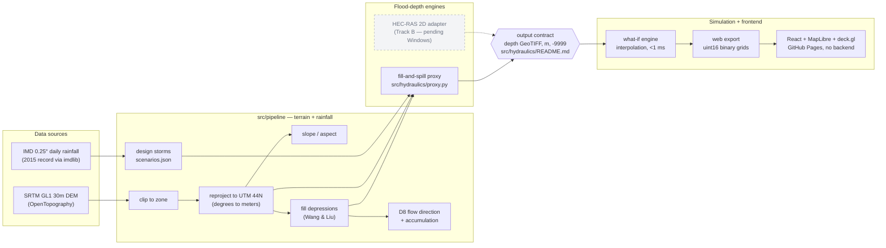
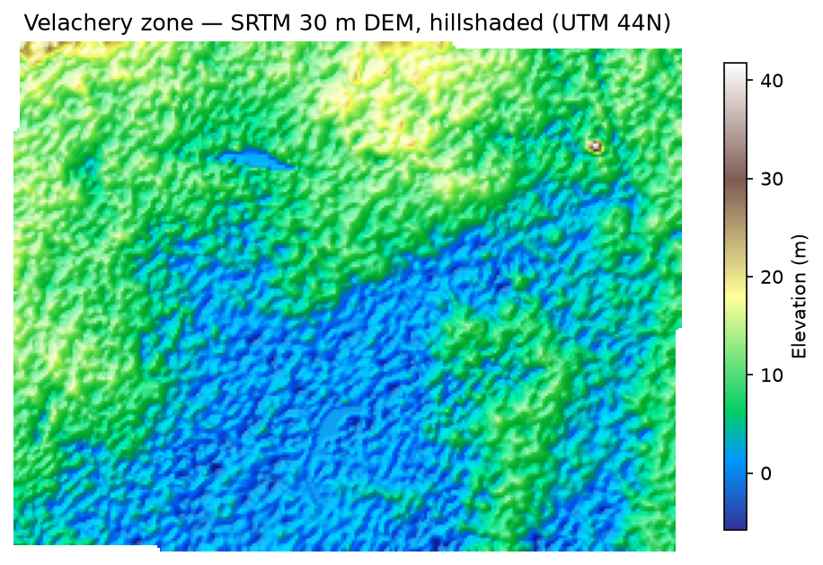
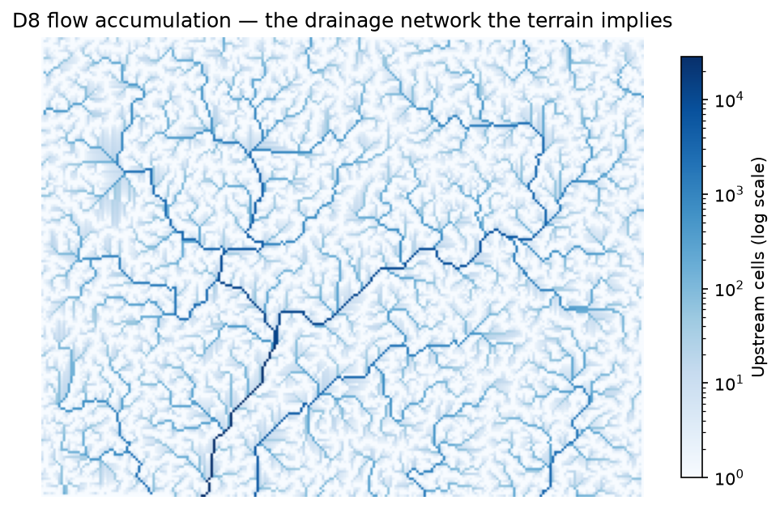
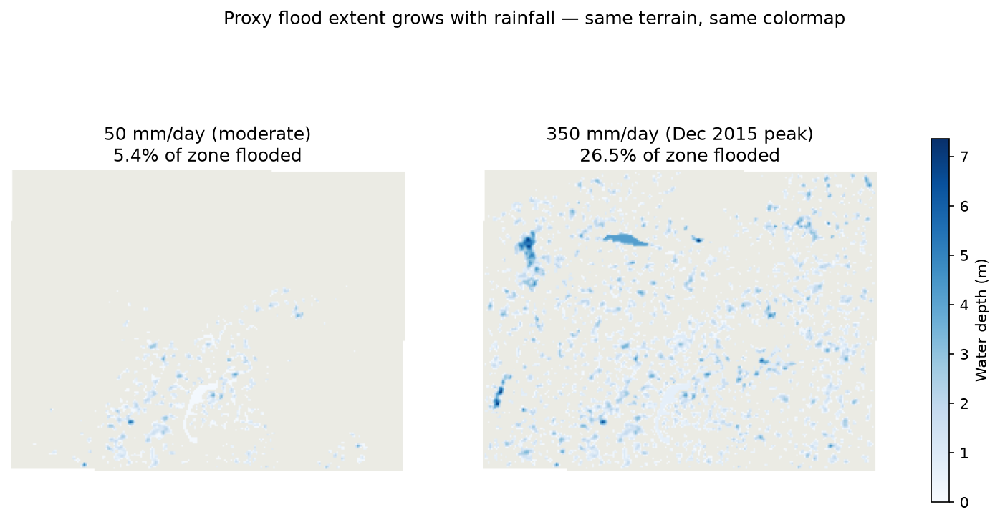
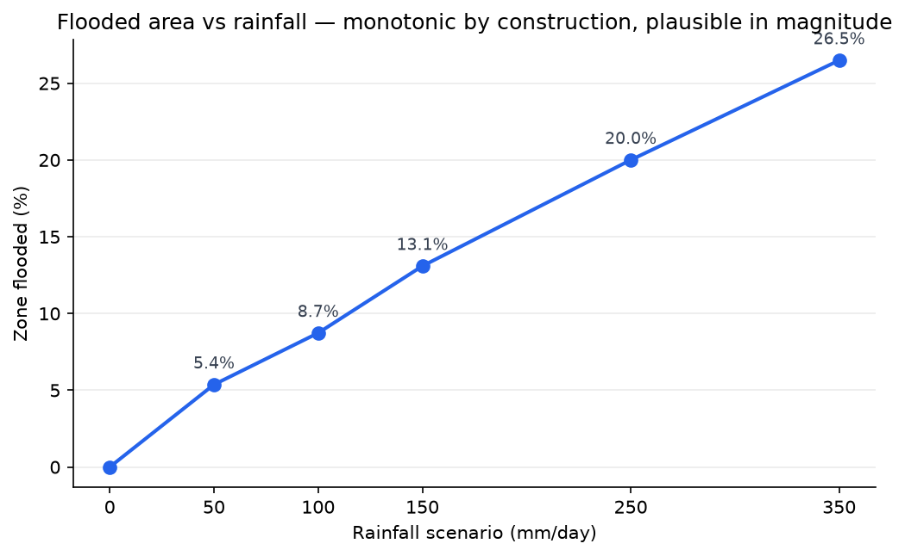

# Terrain-Aware Flood Risk Simulation — Chennai (Velachery)

Interactive flood-risk analysis and what-if scenario simulation for flood-prone
zones in Chennai, built on real terrain, real rainfall records, and a fully
reproducible pipeline.

[](https://kiruthick01.github.io/terrain-aware-drainage-route-optimization/)
[](https://github.com/kiruthick01/terrain-aware-drainage-route-optimization/actions/workflows/deploy.yml)

**Live demo: <https://kiruthick01.github.io/terrain-aware-drainage-route-optimization/>**
— move the rainfall slider and watch a real Chennai neighborhood flood.

<!-- SCREENSHOT/GIF PLACEHOLDER — drop dashboard capture here -->
<!--  -->

---

## The problem

Velachery sits in South Chennai's historic floodplain, ringed by the remnants
of a lake-and-tank system that once absorbed monsoon water. In December 2015,
a single ~350 mm rainfall day put large parts of it under water for days.

Flood tooling today splits into two camps: rigorous hydraulic models
(HEC-RAS 2D) that take hours per run and live inside desktop GIS workflows,
and hazard-map PDFs that answer only one static question. Neither lets a
resident, planner, or journalist ask *"what if it rains 250 mm tomorrow?"*
and see an answer in under a second.

This project builds that interactive layer — honestly. The MVP uses a
simplified terrain-based hydraulic proxy (documented in detail below and
labeled as such in the UI), architected so a real HEC-RAS 2D engine can
replace the proxy without touching anything downstream.

## Architecture

Two-track build: Track A (complete) proves the full pipeline end-to-end with
proxy hydraulics; Track B swaps in HEC-RAS via a fixed output contract —
substitution, not rebuild.



## The terrain

The zone is a ~43 km² tile over Velachery and its drainage context: a low
basin (much of it below 5 m elevation, some SRTM readings below 0 near water)
draining toward the Pallikaranai marsh.



Flow accumulation over the hydrologically conditioned DEM reveals the drainage
network the terrain implies — the dominant channel collects ~26 km² of
upstream area:



**Zone statistics** (from `python -m src.pipeline.run`):

| Statistic | Value |
|---|---|
| Grid | 250 × 187 cells @ 30.3 m (EPSG:32644) |
| Elevation range | −5.8 to 41.7 m |
| Cells in depressions | 13,212 of 47,059 (**28.1%**) |
| Total depression storage | **11.87 million m³** |
| Max depression depth | **7.36 m** |
| Largest catchment | 28,341 cells ≈ 26 km² |

## Flood scenarios — real output, real numbers

Five design storms anchored to the IMD 2015 record (runoff coefficient 0.75):

| Scenario | Rainfall | Effective volume | Capacity used | Zone flooded | Max depth |
|---|---|---|---|---|---|
| moderate | 50 mm | 1.62 Mm³ | 14% | 5.4% | 5.93 m |
| heavy | 100 mm | 3.25 Mm³ | 27% | 8.7% | 6.56 m |
| severe | 150 mm | 4.87 Mm³ | 41% | 13.1% | 6.56 m |
| extreme | 250 mm | 8.12 Mm³ | 68% | 20.0% | 6.56 m |
| extreme_2015_peak | 350 mm | 11.37 Mm³ | **96%** | 26.5% | 7.36 m |





### Validation signal

> **The actual Dec 2015 rainfall peak fills 96% of the zone's total
> depression capacity.**
>
> The IMD gridded record shows the Dec 1–2 2015 Chennai event as 349.6 mm at
> the nearest land cell. Feeding that observed value into the proxy consumes
> 11.37 of the 11.87 Mm³ the terrain can hold — the model says a 2015-scale
> event essentially fills every depression Velachery has, which is what
> happened. A coarse but genuine plausibility check for a proxy model:
> the terrain-capacity math lands the historic flood right at saturation,
> not at 30% and not at 300%. (Rigorous extent-vs-imagery validation is
> Track B work, after real hydraulics.)

## What-if engine

Precomputed scenario rasters + per-cell linear interpolation, so any
`(rainfall, runoff_coeff)` query answers in well under a millisecond:

| Query | Latency | Flooded cells | Max depth |
|---|---|---|---|
| 0 mm | 0.05 ms | 0 | 0 m |
| 30 mm | 0.05 ms | 2,509 | 3.56 m |
| 125 mm (interpolated) | 0.09 ms | 6,118 | 6.56 m |
| 200 mm (interpolated) | 0.06 ms | 9,360 | 6.56 m |
| 350 mm | 0.01 ms | 12,466 | 7.36 m |
| 500 mm (clamped) | 0.05 ms | 12,466 | 7.36 m |

The same logic runs client-side in the dashboard: five uint16 binary grids
(92 KB each, 84 KB gzipped total) + one metadata file, fetched once, blended
in JavaScript. No backend anywhere.

## Methodology

- **Reproject before any slope/flow math.** The DEM arrives in EPSG:4326,
  where cell units are degrees — angles, not distances. Slope is rise/run and
  needs both in meters, so everything is warped to UTM 44N (EPSG:32644,
  ~30.3 m cells, bilinear resampling) first.
- **Fill depressions before flow routing.** SRTM noise creates artificial
  pits; D8 routing strands water in them and fragments the drainage network.
  Wang & Liu priority-flood filling raises each pit to its spill elevation so
  every cell drains to the raster edge. The *fill depth itself*
  (`dem_filled − dem`) is reused as the proxy's depression-storage capacity —
  the conditioning step and the flood model are the same computation viewed
  from two sides.
- **Fill-and-spill proxy.** Effective water volume
  = rainfall × runoff coefficient × zone area. A global water level is raised
  by bisection until stored volume matches, each cell capped at its
  depression's spill depth — lowest terrain floods first, exactly like a
  rising water table. Runoff coefficient (default 0.75, urban) is the "how
  much rain becomes surface water" knob: concrete sheds ~70–90%, vegetated
  soil absorbs most of it.
- **Why the runoff slider is exact, not approximate.** The proxy's output
  depends on inputs *only through effective volume*, so
  `(rain, coeff)` ≡ `(rain × coeff / 0.75, 0.75)` — the coefficient folds
  into an equivalent rainfall and reuses the same five rasters. This identity
  is a property of the proxy; time-dynamic HEC-RAS output won't obey it, and
  Track B will need per-coefficient runs.
- **Clamp, don't extrapolate.** Queries beyond 350 mm equivalent return the
  350 mm state with a visible warning: that scenario already fills 96% of
  terrain capacity, and linear extrapolation would invent water the
  depressions cannot hold.

## Limitations — intentional MVP scope

Same honesty as [SCOPE.md](SCOPE.md); none of these are oversights.

1. **Proxy hydraulics, not HEC-RAS.** No overland flow between depressions,
   no time dynamics, no drainage infrastructure. Output is "where pools
   first, roughly how deep" — not engineering-grade depth.
2. **Rainfall resolution mismatch.** IMD's 0.25° (~27 km) grid vs a 30 m DEM:
   the whole zone is one rainfall value; and the zone's own cell is sea-masked
   in IMD's land mask, so the nearest land cell (~25 km west) stands in.
3. **30 m DEM.** Streets, culverts, and micro-drainage are invisible; SRTM
   also reports up to −6 m near water bodies (artifact, not bathymetry).
4. **One zone.** Velachery only until the pipeline generalizes (Phase 6).

## Repository structure

```
├── data/
│   ├── raw/            # DEM, IMD grids, zone boundary (gitignored, re-downloadable)
│   ├── processed/      # pipeline outputs incl. web export (gitignored, reproducible)
│   └── README.md       # sources, licenses, regeneration steps
├── src/
│   ├── pipeline/       # terrain + rainfall processing, runner with sanity checks
│   ├── hydraulics/     # fill-and-spill proxy + output contract (README)
│   ├── simulation/     # what-if engine + web export (binary format spec in README)
│   └── utils/
├── frontend/           # React + Vite + MapLibre + deck.gl dashboard
├── scripts/            # generate_readme_figures.py (all images above)
├── devlog/             # dated engineering notes
├── SCOPE.md            # MVP definition, non-goals, known limitations
└── ROADMAP.md          # two-track plan, phase by phase
```

## Running locally

```bash
# pipeline (Python 3.12)
python -m venv .venv && source .venv/bin/activate
pip install -r requirements.txt
# put the DEM at data/raw/chennai_velachery_dem.tif (see data/README.md)
python -m src.pipeline.make_zone_boundary
python -m src.pipeline.run          # regenerates all of data/processed/

# dashboard
cd frontend && npm install
cp ../data/processed/web/* public/data/
npm run dev
```

## Tech stack

| Layer | Tools |
|---|---|
| Terrain processing | rasterio, geopandas, shapely, pyproj, numpy |
| Hydrology | WhiteboxTools (fill, D8 flow) via `whitebox` |
| Rainfall | imdlib (IMD gridded daily) |
| Simulation | numpy engine + headerless uint16 web export |
| Frontend | React, Vite, MapLibre GL, deck.gl (BitmapLayer) |
| Deploy | GitHub Actions → GitHub Pages, fully static |

## Data sources & licenses

| Source | Use | License |
|---|---|---|
| [OpenTopography](https://opentopography.org) SRTM GL1 | 30 m DEM | Public domain (NASA/USGS); acknowledgment requested |
| [IMD](https://imdpune.gov.in) via [imdlib](https://imdlib.readthedocs.io) | 0.25° daily rainfall | Free for research; cite Pai et al. (2014), *Mausam* 65(1) |
| [CARTO](https://carto.com) / [OSM](https://www.openstreetmap.org/copyright) | Basemap tiles | CARTO attribution + ODbL |

## What's next

Track B, once Windows hardware is available: HEC-RAS 2D rain-on-grid runs
automated via RAS-Commander, an adapter emitting the existing output
contract, and honest extent validation against the documented 2015 flooding.
Full plan in [ROADMAP.md](ROADMAP.md).
